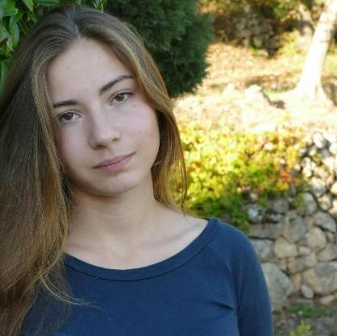

* Email: marie-eva DOT fabri AT univ-lille DOT fr
* Current position: PhD Student at [Université de Lille](https://univ-lille.fr/) in the [SyCoMoRES](https://team.inria.fr/sycomores/) team with [Patrick Baillot](https://pro.univ-lille.fr/patrick-baillot/), [Sara Riva](https://sarariva.github.io) and [Cristian Versari](https://www.cristal.univ-lille.fr/~versaric/). 
* [CV](pdf/CV.pdf)

# PhD subject

My current research focuses on discrete dynamical systems, boolean networks and the abstraction of biological systems.

#  Talks

* Dynamic Abstract Interpretation of Partial Reaction Networks
    - [Journées **GT BIOSS** 2025](https://gt-bioss.cnrs.fr/events/jnbioss25/)
    - [CANA team seminar](https://cana.lis-lab.fr/)
* Construction of Semi-Uniform Membranes Structures in a Uniform Way
    - [CMC 2022](http://cmc2022/units.it)

# Teaching

* 2025-2026
    - [TD/TP Programmation et Raisonnement](https://www.fil.univ-lille.fr/portail/index.php?dipl=L&sem=S3&ue=AlgDem&label=Pr%C3%A9sentation) (Univ. Lille)
    - [TD/TP Programmation Fonctionnelle](https://www.fil.univ-lille.fr/portail/index.php?dipl=L&sem=S5M&ue=PF&label=Pr%C3%A9sentation) (Univ. Lille)
* 2024-2025
    - [TD/TP Algorithmes et Programmation 2](https://www.fil.univ-lille.fr/portail/index.php?dipl=L1_MI&sem=L1MIS2&ue=AP&label=Pr%C3%A9sentation) (Univ. Lille)
    - [TD/TP Logique](https://www.fil.univ-lille.fr/portail/index.php?dipl=L&sem=S3&ue=Logique&label=Pr%C3%A9sentation) (Univ. Lille)
* 2023-2024
    - Colles d'informatique en MPI (Lycée du Parc)
* 2020-2021
    - Colles de mathématique en PCSI (CIV)

